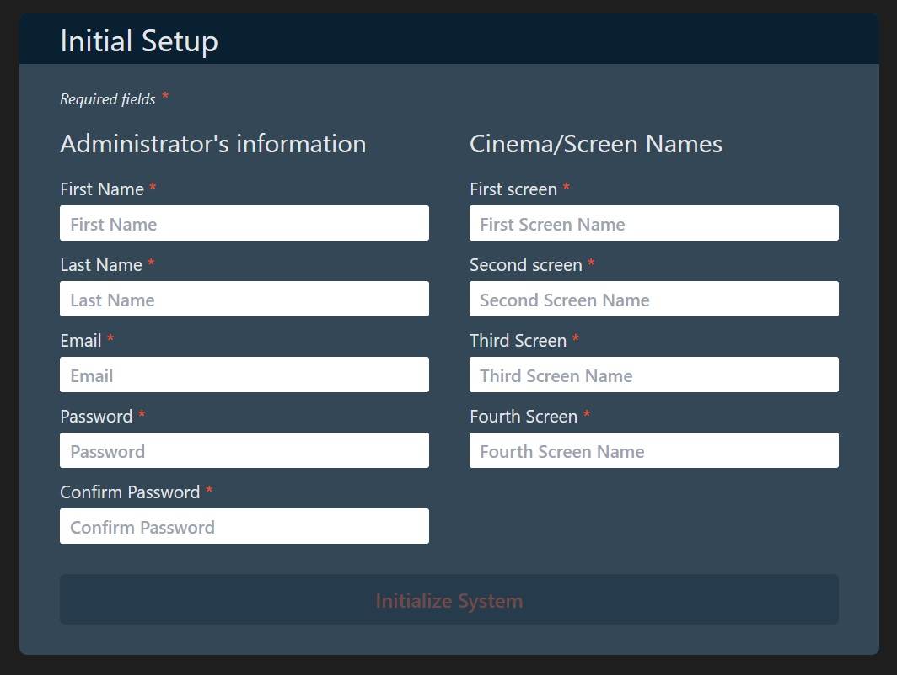
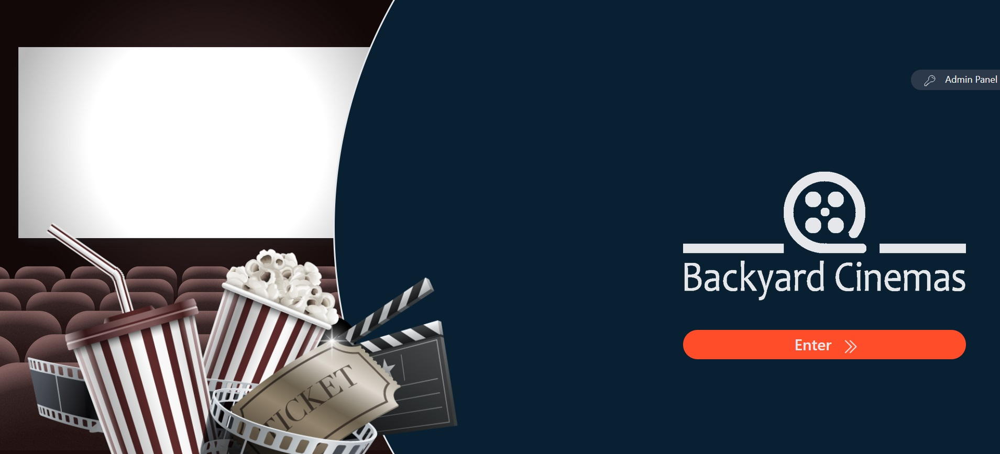
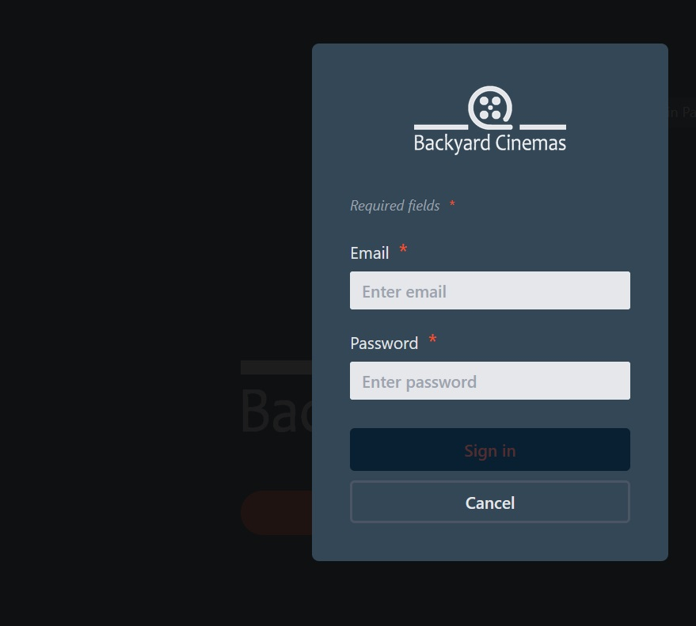
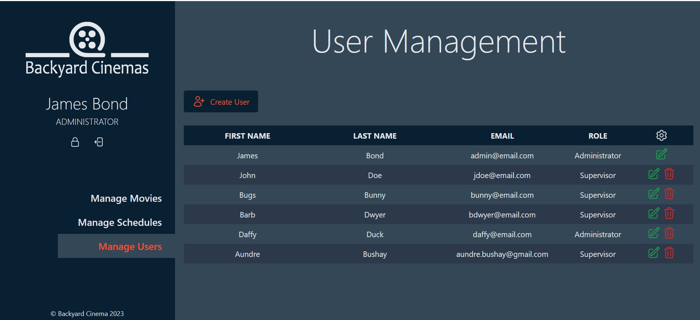
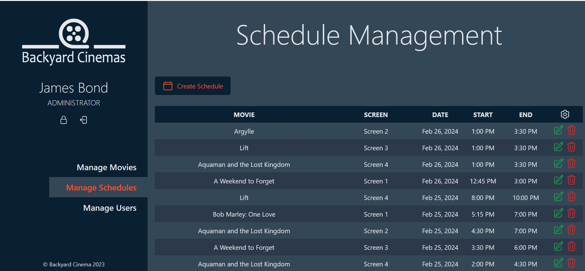
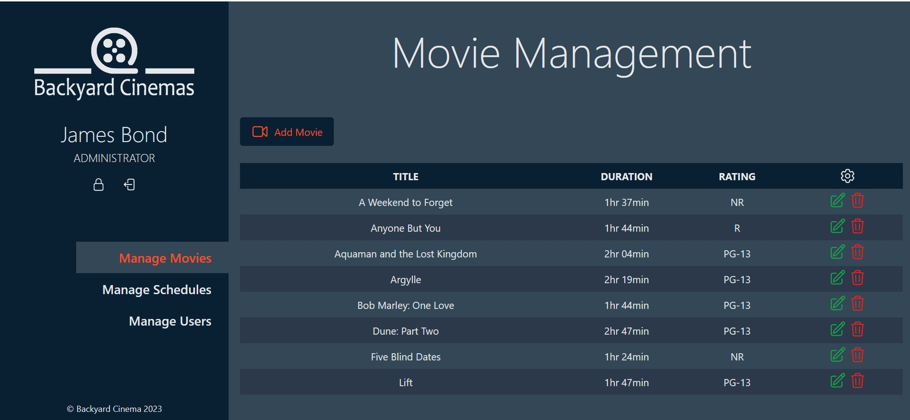
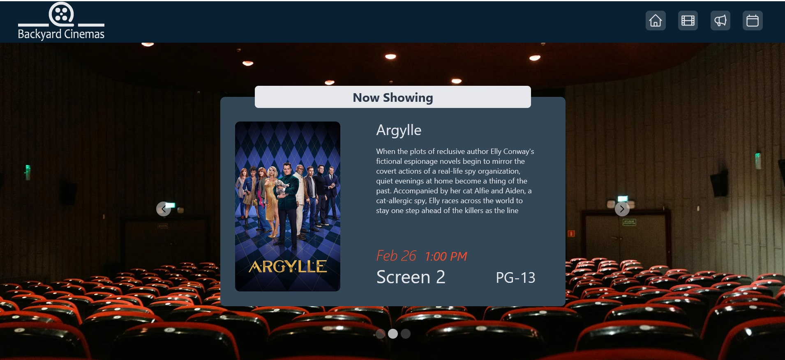
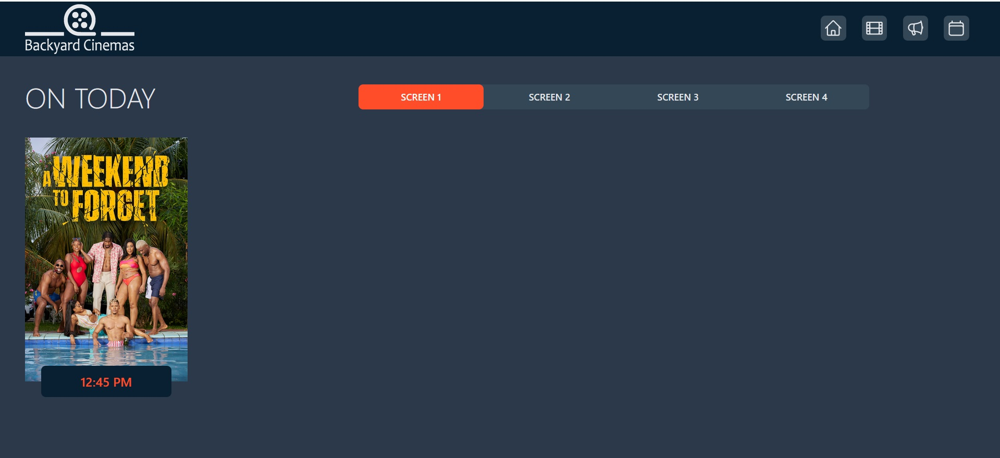
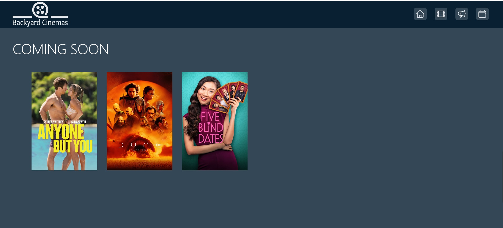
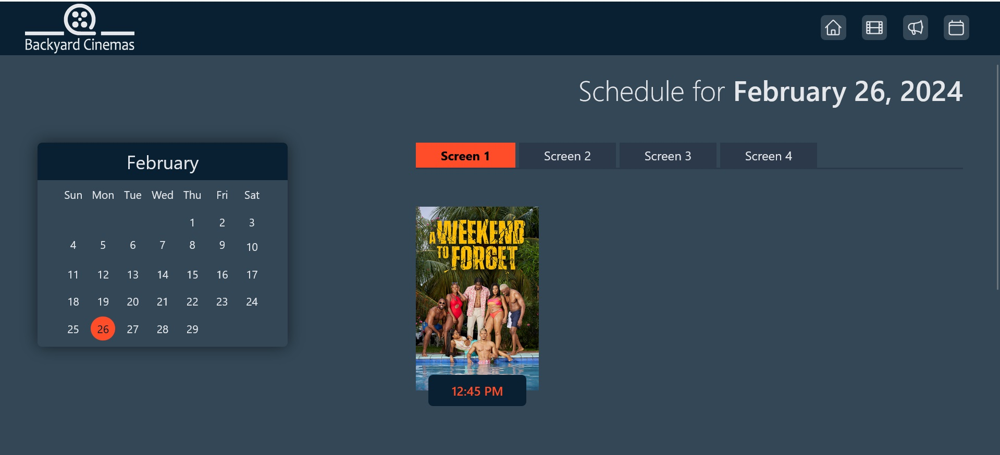

# Backyard Cinemas Ltd
## Cinema Management System
#### Overview
Backyard Cinemas Ltd was established in 1999 and consists of 4 cinema screens, each with a 100 seat capacity. Their ultimate goal is to deliver an outstanding experience for moviegoers.
#### Description
This application is a cinema management system designed for Backyard Cinemas Ltd. It enables the management of movies, schedules and user accounts in a secure environment.

Authorized users sign in using email and password and are categorized as either a supervisor or an administrator. Supervisors will have full management access for movies and schedules, i.e., they can add, edit, and delete. Whereas, administrators possess all the authority of supervisors along with access to add, edit and delete user accounts.

###
Anonymous users, also referred to as Patrons, should be able to view daily and monthly schedules, upcoming movies and movie information including watching trailers.

#### Technologies
Project constraints had a telling influence on the technologies used. These are:
- Frontend - HTML, tailwindCSS, javascript
- Server - PHP
- Database - MySQL
- API - [The Movie Database](https://www.themoviedb.org)
#
## Screenshots
### 1. Initialization

This form is presented if the database is not yet created. It captures information of the administrator along with the 4 cinema screen names. Successful initialization will create the database and all tables. The information entered on this form will also be stored in the database.

#
### 2. Welcome Page

From here, authorized users can click the admin panel button (top-right) to access the login form. Otherwise, anonymous users can click the enter button to access the main page.
#
### 3. Login

A valid email and password must be entered in the login form. A valid password consists of at least 8 characters, and contains uppercase, lowercase and number

#
### 4. Admin Panel

#
### 5.Main page

#
### 6. View Schedule page

#
#
#### Development Team
[Aundre Bushay](https://www.github.com/kriane07), [Orville Hall](https://www.github.com/orvilleHall27), [Bryan Scarlett](https://github.com/b-scarlett)

### Acknowledgements
#### Images
- [Pexels](https://www.pexels.com)
- [Pixabay](https://www.pixabay.com)
- [Clean PNG](https://www.cleanpng.com)

#### Icons
- [Heroicons](https://www.heroicons.com/)

#### Color Scheme
- [Color Hunt](https://colorhunt.co/palette/0820322c394b334756ff4c29)

